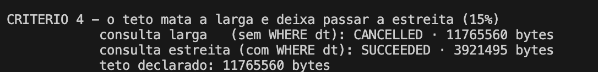
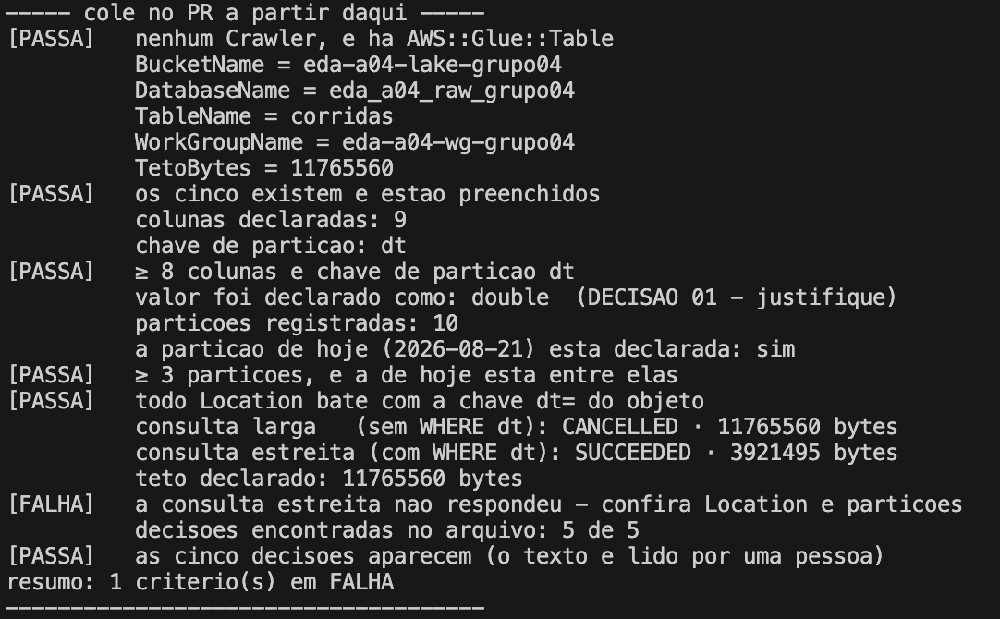
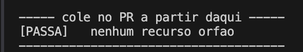

# DECISAO 01
Sobre os números para valor, escolhemos manter o double porque mesmo que as 1.5% das linhas vão dar problema, conseguimos extrair muito valor do restante dos dados, visto que temos uma boa quantidade de dados. Esse erro não parece ser recorrente, então faz mais sentido mitigar esse erro e posteriormente resolver, do que não ter nenhuma consulta
# DECISAO 02
Para as colunas de tempo, optamos por manter em string porque assim ainda podíamos fazer as consultas usando between e caso houvesse alguma data enviada em um padrão incorreto, podemos manter ela sem que a consulta quebre inteiramente, quanto testamos com string, conseguimos fazer a consulta corretamente
# DECISAO 03
Colocamos o ignore json porque não queremos que as querys sejam derrubadas por algum erro, queremos o resultado de toda a forma e rapidamente, a ideia seria colocar algumas validações de data quality antes de enviar os dados para o S3. Ainda assim tivemos um erro de BAD_DATA para o parse dos dados de double devido as vírgulas, precisamos colocar também a property 'use.null.for.invalid.data' = 'true', na tabela para conseguir fazer a consulta
# DECISAO 04
As partições devem ser declaradas para que o Athena consiga enxerga esses dados, quando eu rodo: SELECT count(*), dt FROM corridas GROUP BY dt, só aparecem as dts declaradas mesmo que outras existam, o que acontece com o dia 31: ele não aparece nesse tipo de query, porque essa partição não foi declarada, seguindo a lógica do deploy.sh devemos declarar 19 partições(a partir do dia 18) para aparecer a 31
# DECISAO 05
O numero de piso e teto para essa atividade foram medidos a partir do mínimo aceitável da AWS e o numero total de bits dos dados -1, isso serve para restringir consultas de modo que nenhuma consulta passe pelo lake inteiro, o que decidimos foi 11765560 porque é o numero total /10 que seria aproximadamente 3 dias de corrida, é o suficiente para responder boa parte das perguntas
ainda assim tivemos um problema que no verifica.sh que diz que ele deixa passar a query larga, ainda que o status de quando rodamos apareça o status CANCELLED

# Saídas do verifica.sh

